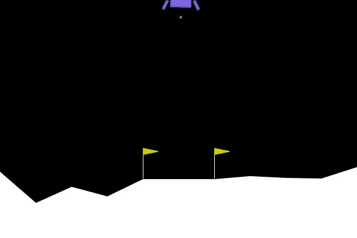
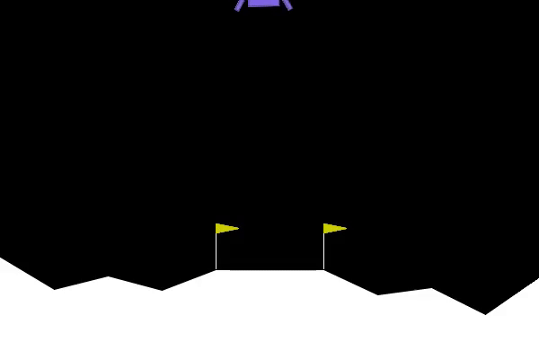
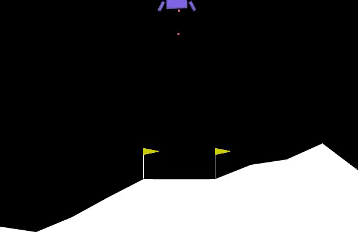

# LLM-RL-Design: Automating Reward Function Design with LLMs for Reinforcement Learning

## Overview

This repository contains the code and resources for my Master's thesis (TFM) titled *"LLMs aplicados al diseño automático de agentes basados en RL"*, submitted as part of the *Máster en Big Data: Tecnología y Analítica Avanzada* at the Escuela Técnica Superior de Ingeniería (ICAI) in June 2024. The project investigates the integration of Large Language Models (LLMs) into the design of reward functions for Reinforcement Learning (RL) agents, aiming to automate and enhance the reward shaping process.

### Idea

The design of reward functions in RL is a critical yet challenging task. Traditionally, it requires manual effort, deep domain knowledge, and is prone to errors that can lead to suboptimal agent behavior. This project proposes using LLMs (specifically GPT-4o-mini) to automate the generation of reward functions, leveraging their natural language understanding and code generation capabilities to translate high-level task descriptions into executable reward logic. The approach explores two strategies:

- **Static**: A single reward function is generated by the LLM at the start of training.
- **Dynamic**: The reward function is updated periodically during training based on the agent's performance history.

The goal is to evaluate whether LLM-generated reward functions can improve the learning efficiency and robustness of RL agents compared to manually designed rewards.

## Project Description

### Methodology

The project is implemented as a modular Python system, designed to integrate LLMs into the RL training pipeline. Key components include:

- **`run_experiment.py`**: The main script for configuring and running experiments, selecting the environment (e.g., LunarLander-v2, BipedalWalker-v3), RL algorithm (PPO for continuous, DQN for discrete), and training the agent.
- **`llm_interface.py`**: Handles interaction with the LLM (GPT-4o-mini via OpenAI API), generating prompts and querying the model to produce reward functions.
- **`custom_reward_env.py`**: Implements a Gymnasium wrapper (`LLMRewardWrapper`) to integrate LLM-generated reward functions into the environment, supporting both static and dynamic strategies.

#### Environments
Experiments were conducted in two standard Gymnasium environments:
- **LunarLander-v2**: The agent must land a lunar module softly between two points.
- **BipedalWalker-v3**: The agent must control a bipedal robot to walk forward without falling.

#### Strategies
Three strategies were evaluated:
1. **Baseline**: Uses the environment's default reward function.
2. **Static**: Uses a single LLM-generated reward function throughout training.
3. **Dynamic**: Updates the reward function every 10% of training timesteps, adapting to the agent's behavior.

### Implementation Details
- **Prompt Engineering**: Prompts are generated automatically based on the environment's description, objectives, and observable variables, ensuring the LLM produces valid reward functions.
- **Validation**: Generated reward functions are validated to return a single float value, avoid external libraries, and handle observation spaces safely.
- **Cost**: The use of GPT-4o-mini incurs a minimal cost (1-2 cents per experiment), making the approach economically viable.

## Results

### Quantitative Results

The performance of the three strategies was evaluated over 100,000 timesteps in both environments. Key findings:

#### LunarLander-v2
| Strategy  | Mean Reward   | Std Dev   | Episode Length | Training Time (s) |
|-----------|---------------|-----------|----------------|-------------------|
| Baseline  | -157.58       | ±76.84    | 622.6          | 62.09             |
| Static    | -154.48       | ±248.49   | 819.55         | 66.6              |
| Dynamic   | **125.71**    | ±41.27    | 163.55         | 1237.74           |

- **Dynamic** achieves the highest mean reward (125.71), with faster convergence and shorter episodes, indicating a more effective policy.
- **Static** shows a slight improvement over Baseline but is highly inconsistent (high std dev).
- **Baseline** fails to learn an effective policy, resulting in a negative reward.

#### BipedalWalker-v3
| Strategy  | Mean Reward   | Std Dev   | Episode Length | Training Time (s) |
|-----------|---------------|-----------|----------------|-------------------|
| Baseline  | -83.24        | ±43.21    | 192.3          | 249.88            |
| Static    | 52.0          | ±37.84    | 114.6          | 251.57            |
| Dynamic   | **105.74**    | ±24.39    | 1600           | 2494.44           |

- **Dynamic** again outperforms, achieving a mean reward of 105.74 and enabling long, successful walks.
- **Static** improves over Baseline, learning a basic walking policy.
- **Baseline** struggles, with a negative reward and inefficient walking.

### Qualitative Results (GIFs)

Below are animated GIFs showing the behavior of the agent in LunarLander-v2 under each strategy:

- **Baseline**: The lunar lander remains nearly immobile, failing to learn a landing policy.  
  

- **Static**: The lander descends progressively but fails to land properly, remaining tilted.  
  

- **Dynamic**: The lander descends in a controlled manner and approaches the landing zone, though a final adjustment is needed.  
  

These GIFs demonstrate the progressive improvement from Baseline to Dynamic, with the Dynamic strategy achieving the most sophisticated behavior.

## Installation

To run the experiments, follow these steps:

1. Clone the repository:
   ```bash
   git clone https://github.com/enrigg/LLM-RL-Design.git
   cd LLM-RL-Design
   ```

2. Create a virtual environment and install dependencies:
   ```bash
   python -m venv venv
   source venv/bin/activate  # On Windows: venv\Scripts\activate
   pip install -r requirements.txt
   ```

3. Set up your OpenAI API key:
   - Create a `.env` file in the root directory.
   - Add your API key:
     ```plaintext
     OPENAI_API_KEY=your-api-key-here
     ```

### Arguments
- `--env`: The Gymnasium environment (`LunarLander-v2` or `BipedalWalker-v3`).
- `--strategy`: The reward strategy (`baseline`, `static`, or `dynamic`).
- `--timesteps`: Number of training timesteps (default: 100,000).

Results will be logged, and videos of the agent's behavior will be saved in the `logs/` directory.

## References

- [1] Ma, Y.; Zhang, Y.; Li, J.; et al. "REvolve: reward Evolution with large language model using Human Feedback". *Advances in Neural Information Processing Systems (NeurIPS)*, New Orleans, LA, USA, 2023.
- [2] Smith, A.; Johnson, L. "A simple framework for intrinsic reward-shaping for RL using LLM feedback". *IEEE Transactions on Artificial Intelligence*, vol. 3, no. 4, 2022, p. 512-520.
- [3] Wang, Z.; Chen, H.; Liu, X. "Eureka: Using LLM to create reward function". *arXiv preprint arXiv:2305.12345*, 2023. https://arxiv.org/abs/2305.12345

## License

This project is licensed under the MIT License - see the [LICENSE](LICENSE) file for details.

## Acknowledgments

- Thanks to my thesis advisor, Martín Gallardo, for his guidance.
- Thanks to ICAI for providing the resources to conduct this research.